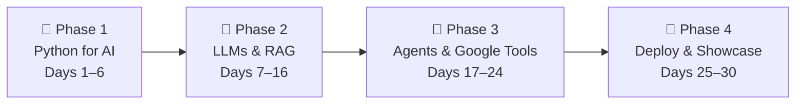

# 🚀 30-Day AI Engineering Roadmap
### From Web Developer → AI App Builder
**Profile:** Basic Python syntax | 4 hours/day | 120 hours total | Goal: Build RAG apps, chatbots & agents

---

## 🧭 Philosophy: What This Roadmap Is (and Isn't)

This is **not** a machine learning research roadmap. You will **not** train models, tune neural networks, or touch PyTorch in any deep way.

This roadmap teaches you to be an **AI Application Engineer** — someone who:
- Understands how LLMs work *well enough* to use them effectively
- Can build end-to-end RAG pipelines, chatbots, and agents in Python
- Ships production-ready AI apps with proper evaluation and observability
- Has a portfolio and certificates to prove it

> **Rule of thumb:** If a concept doesn't directly help you build something, it is filtered out.

---

## 🗺️ The Big Picture (4 Phases)



---

## 🎓 All Free Certificates You Will Earn

| # | Course | Platform | Hours | Certificate |
|---|--------|----------|-------|-------------|
| 1 | Pandas | Kaggle | 4h | ✅ Free |
| 2 | Intro to Machine Learning | Kaggle | 3h | ✅ Free |
| 3 | Prompt Engineering for Developers | DeepLearning.AI | 1.5h | ✅ Free |
| 4 | Building Systems with the ChatGPT API | DeepLearning.AI | 2h | ✅ Free |
| 5 | LangChain: Chat with Your Data | DeepLearning.AI | 2.5h | ✅ Free |
| 6 | Building & Evaluating Advanced RAG | DeepLearning.AI | 2h | ✅ Free |
| 7 | Functions, Tools & Agents with LangChain | DeepLearning.AI | 3h | ✅ Free |
| 8 | Introduction to LangChain | LangChain Academy | 6h | ✅ Free |
| 9 | Introduction to LangGraph | LangChain Academy | 6h | ✅ Free |
| 10 | Google AI Essentials | Coursera (Google) | ~10h | ✅ Free (audit) |

**Target: 9–10 certificates by Day 30** — ready to add to LinkedIn and resume.

---

## 📦 Portfolio Projects You Will Build

| Project | What It Demonstrates |
|---------|----------------------|
| `day2-embeddings-from-scratch` | Understanding of vectors, cosine similarity |
| `day4-llm-pipeline-cli` | Prompt engineering, structured outputs, Python CLI |
| `day8-langchain-classifier` | LangChain fundamentals, LCEL chaining |
| `day12-rag-chatbot` ⭐ | Full RAG pipeline — your flagship project |
| `day18-research-agent` | LangGraph agents, tool use, stateful workflows |
| `day22-gemini-firebase-app` | Google AI Studio + Firebase Genkit integration |

---

## 📚 Phase 1 — Python for AI Foundations (Days 1–6)

**Goal:** Speak the language of AI engineering. Close the Python-for-AI gap.

### Core Concepts You'll Learn
- **NumPy arrays** — the substrate of every tensor and embedding
- **Pandas DataFrames** — loading, inspecting, and cleaning data
- **Embeddings** — what they are, why they exist, and how to use them
- **Cosine similarity** — the math behind semantic search (it's just a dot product)
- **LLM vocabulary** — tokens, context windows, temperature, top-p

### Key Resources

| Resource | Link | Time |
|----------|------|------|
| Kaggle Pandas | [kaggle.com/learn/pandas](https://www.kaggle.com/learn/pandas) | 4h |
| Kaggle Intro to ML | [kaggle.com/learn/intro-to-machine-learning](https://www.kaggle.com/learn/intro-to-machine-learning) | 3h |
| DL.AI: Text Embeddings | [learn.deeplearning.ai/courses/google-cloud-vertex-ai](https://learn.deeplearning.ai/courses/google-cloud-vertex-ai) | 1.5h |
| DL.AI: Vector Databases | [learn.deeplearning.ai/courses/building-applications-vector-databases](https://learn.deeplearning.ai/courses/building-applications-vector-databases) | 2h |
| DL.AI: Prompt Engineering for Developers | [learn.deeplearning.ai/courses/chatgpt-prompt-eng](https://learn.deeplearning.ai/courses/chatgpt-prompt-eng) | 1.5h |

---

## 🧠 Phase 2 — LLMs, LangChain & RAG (Days 7–16)

**Goal:** Build a full RAG pipeline. This is the #1 skill AI engineering interviews test.

### Core Concepts You'll Learn
- **LangChain LCEL** — composable pipelines (`prompt | model | parser`)
- **RAG Architecture** — Documents → Chunks → Embeddings → Vector Store → Retrieval → LLM → Answer
- **ChromaDB** — lightweight local vector database for development
- **Advanced RAG patterns** — HyDE, multi-query retrieval, contextual compression
- **RAGAS** — evaluating RAG quality (faithfulness, relevancy, context precision)

### Key Resources

| Resource | Link | Time |
|----------|------|------|
| LangChain Academy: Intro to LangChain | [academy.langchain.com/courses/intro-to-langchain](https://academy.langchain.com/courses/intro-to-langchain) | 6h |
| DL.AI: Chat with Your Data | [learn.deeplearning.ai/courses/langchain-chat-with-your-data](https://learn.deeplearning.ai/courses/langchain-chat-with-your-data) | 2.5h |
| DL.AI: Building & Evaluating Advanced RAG | [learn.deeplearning.ai/courses/building-evaluating-advanced-rag](https://learn.deeplearning.ai/courses/building-evaluating-advanced-rag) | 2h |
| DL.AI: Building Systems with the ChatGPT API | [learn.deeplearning.ai/courses/chatgpt-building-system](https://learn.deeplearning.ai/courses/chatgpt-building-system) | 2h |
| DL.AI: Advanced Retrieval with Chroma | [learn.deeplearning.ai/courses/advanced-retrieval-for-ai](https://learn.deeplearning.ai/courses/advanced-retrieval-for-ai) | 2h |

### The RAG Pipeline You Must Know Cold

```
1. Load Documents  →  PDFs, .txt, web pages
2. Split/Chunk     →  RecursiveCharacterTextSplitter
3. Embed           →  OpenAI / Gemini embeddings model
4. Store           →  ChromaDB / Firestore Vector Search
5. Query           →  User question → embed → similarity search
6. Retrieve        →  Top-k matching chunks returned
7. Generate        →  Chunks + question → LLM → final answer
```

---

## 🤖 Phase 3 — Agents & Google Tools (Days 17–24)

**Goal:** Build stateful AI agents. Integrate with your Google Cloud project and Firebase.

### Core Concepts You'll Learn
- **LangGraph** — stateful graph-based agent orchestration
- **ReAct pattern** — Reasoning + Acting loops
- **Tool calling** — giving LLMs access to functions, search, databases
- **Google AI Studio** — prototyping Gemini prompts and getting API keys
- **Firebase Genkit** — deploying AI flows securely with Firebase Auth
- **LangSmith** — tracing and observing production LLM calls

### Key Resources

| Resource | Link | Time |
|----------|------|------|
| LangChain Academy: Intro to LangGraph | [academy.langchain.com/courses/intro-to-langgraph](https://academy.langchain.com/courses/intro-to-langgraph) | 6h |
| DL.AI: Functions, Tools & Agents | [learn.deeplearning.ai/courses/functions-tools-agents-langchain](https://learn.deeplearning.ai/courses/functions-tools-agents-langchain) | 3h |
| DL.AI: LLMOps | [learn.deeplearning.ai/courses/llmops](https://learn.deeplearning.ai/courses/llmops) | 2h |
| Google AI Studio | [aistudio.google.com](https://aistudio.google.com/) | — |
| Firebase Console | [console.firebase.google.com](https://console.firebase.google.com/) | — |
| LangSmith (free tier) | [smith.langchain.com](https://smith.langchain.com) | — |

---

## 🚢 Phase 4 — Deploy, Certify & Showcase (Days 25–30)

**Goal:** Make everything public, polished, and findable by recruiters.

### Platforms to Activate

| Platform | Action |
|----------|--------|
| [me.developers.google.com](https://me.developers.google.com/) | Complete profile, earn developer badges |
| [skills.google](https://www.skills.google/) | Complete Google Cloud Generative AI learning path |
| [coursera.org/google-certificates/google-ai](https://www.coursera.org/google-certificates/google-ai) | Complete Google AI Essentials (audit = free) |
| GitHub | Polish all project READMEs with architecture diagrams |
| LinkedIn | Add all certificates, update headline, write 1 featured post |
| NotebookLM | [notebooklm.google](https://notebooklm.google/) — use it to research topics and prep for interviews |

---

## 📅 30-Day Daily Calendar

> **Format:** Each day = ~4 hours. Split as: 1.5–2h learning + 1.5–2h hands-on building.

---

### 🗓️ Week 1 — Python for AI (Days 1–6)

---

#### Day 1 — Environment Setup + Python Review
**Study (2h):**
- Install: Python 3.11+, VS Code, `pip`, `venv`
- Get your **Gemini API key** from [Google AI Studio](https://aistudio.google.com/) (link to your GCP project `crypto-snow-426714-f1`)
- Create a GitHub repo: `ai-engineering-journey`
- Read: [What is an LLM? — beginner explainer](https://www.cloudflare.com/learning/ai/what-is-a-large-language-model/) (30 min)

**Build (2h):**
- Create a Python virtual environment
- Write `hello_gemini.py` — a Python script that calls the Gemini API with a simple prompt using the `google-generativeai` library
- Store your API key in a `.env` file, load it with `python-dotenv`
- Push to GitHub with a README explaining what you built

**Installs:**
```bash
pip install google-generativeai python-dotenv
```

---

#### Day 2 — NumPy + Embeddings Intuition
**Study (2h):**
- [Kaggle Pandas](https://www.kaggle.com/learn/pandas) — complete the first 3 lessons (DataFrames, indexing, summary functions)
- Watch: [What are Embeddings? — 10 min YouTube explainer by Josh Starmer](https://www.youtube.com/watch?v=viZrOnJclY0)

**Build (2h):**
- Write a Python script that:
  1. Generates embeddings for 10 sentences using the Gemini Embedding API
  2. Computes cosine similarity between two sentences manually using NumPy
  3. Prints which pair of sentences are most similar

```python
import numpy as np

def cosine_similarity(a, b):
    return np.dot(a, b) / (np.linalg.norm(a) * np.linalg.norm(b))
```
- Push to GitHub as `day2-embeddings-from-scratch`

**Installs:**
```bash
pip install numpy
```

---

#### Day 3 — Pandas + ML Vocabulary
**Study (2h):**
- [Kaggle Pandas](https://www.kaggle.com/learn/pandas) — complete the remaining lessons
- [Kaggle Intro to Machine Learning](https://www.kaggle.com/learn/intro-to-machine-learning) — complete lessons 1–4 (skip deep model training)
- Key concepts to understand: training/test splits, overfitting, accuracy vs. loss

**Build (2h):**
- Load a CSV dataset from Kaggle (e.g., [Titanic](https://www.kaggle.com/c/titanic/data))
- Clean it with Pandas: handle nulls, select columns, inspect data types
- Run a basic `scikit-learn` decision tree on it
- Export results to a new CSV
- Push as `day3-pandas-basics`

**Installs:**
```bash
pip install pandas scikit-learn
```

---

#### Day 4 — Prompt Engineering Fundamentals
**Study (2h):**
- [DL.AI: Prompt Engineering for Developers](https://learn.deeplearning.ai/courses/chatgpt-prompt-eng) — full course (~1.5h)
- Key patterns to internalize: zero-shot, few-shot, chain-of-thought, structured output (JSON mode)

**Build (2h):**
- Build a Python CLI tool `cli_assistant.py` that:
  1. Takes a user question as input
  2. Routes it to one of two prompt templates (e.g., "technical question" vs. "general question") based on a classification call
  3. Returns a structured JSON response using a system prompt that enforces JSON output
- Push to GitHub as `day4-llm-pipeline-cli`

---

#### Day 5 — Building LLM Pipelines
**Study (2h):**
- [DL.AI: Building Systems with the ChatGPT API](https://learn.deeplearning.ai/courses/chatgpt-building-system) — full course (~2h)
- Focus: classification chains, multi-step pipelines, moderation, input validation

**Build (2h):**
- Extend `day4-llm-pipeline-cli` with:
  1. A **moderation check** — if input contains harmful content, reject it
  2. A **multi-step pipeline** — classify input → choose prompt template → generate response → validate output format
  3. Add a simple `while True` loop for a continuous conversation in the terminal

---

#### Day 6 — Review, Certificates & GitHub Cleanup
**Study (1h):**
- Complete and claim your **Kaggle Pandas certificate** and **Kaggle Intro to ML certificate**
- Claim your **DL.AI Prompt Engineering certificate**

**Build (3h):**
- Write proper README files for all 3 projects pushed this week. Each README must include:
  - What the project does (1 paragraph)
  - How to run it locally (setup steps)
  - What you learned
- Post on LinkedIn: *"Day 6 of my AI Engineering journey — I've completed my first 3 certificates and built my first LLM pipeline in Python. Here's what I learned about prompt engineering..."*
- Push everything to GitHub

---

### 🗓️ Week 2 — LangChain Core + RAG (Days 7–16)

---

#### Day 7 — LangChain Foundations Part 1
**Study (2h):**
- [LangChain Academy: Introduction to LangChain](https://academy.langchain.com/courses/intro-to-langchain) — start and complete Modules 1–2
- Key mental model: `prompt | model | parser` is a pipeline. Each `|` is a Runnable.

**Build (2h):**
- Recreate your Day 4 pipeline using LangChain LCEL instead of raw API calls:
```python
from langchain_google_genai import ChatGoogleGenerativeAI
from langchain_core.prompts import ChatPromptTemplate
from langchain_core.output_parsers import StrOutputParser

llm = ChatGoogleGenerativeAI(model="gemini-2.0-flash")
prompt = ChatPromptTemplate.from_template("Answer this: {question}")
chain = prompt | llm | StrOutputParser()
print(chain.invoke({"question": "What is RAG?"}))
```
- Push update to your existing repo or as `day7-langchain-intro`

**Installs:**
```bash
pip install langchain langchain-google-genai langchain-core
```

---

#### Day 8 — LangChain Foundations Part 2
**Study (2h):**
- [LangChain Academy: Introduction to LangChain](https://academy.langchain.com/courses/intro-to-langchain) — complete Modules 3–4
- Focus: memory management, conversation history, output parsers (JSON, Pydantic)

**Build (2h):**
- Build a document classifier using LangChain:
  1. Takes a short piece of text as input
  2. Uses a Pydantic output parser to return `{"category": "...", "confidence": 0.9, "reason": "..."}`
  3. Has a `ConversationBufferMemory` so it remembers the last 3 inputs
- Push as `day8-langchain-classifier`

**Installs:**
```bash
pip install pydantic
```

---

#### Day 9 — LangChain Foundations Part 3 + Certificate
**Study (2h):**
- [LangChain Academy: Introduction to LangChain](https://academy.langchain.com/courses/intro-to-langchain) — complete remaining modules and claim certificate

**Build (2h):**
- Build a **multi-turn chatbot** in Python with:
  - A customizable system prompt (passed as a variable)
  - Conversation history that persists across turns
  - A `/clear` command to reset memory
  - A `/summarize` command to ask the LLM to summarize the conversation so far

---

#### Day 10 — RAG Part 1: Document Loading & Chunking
**Study (2h):**
- [DL.AI: LangChain: Chat with Your Data](https://learn.deeplearning.ai/courses/langchain-chat-with-your-data) — Modules 1–3 (Document Loaders, Splitting, Embeddings)
- Key concepts: `RecursiveCharacterTextSplitter`, chunk size, chunk overlap, why chunking strategy matters

**Build (2h):**
- Write a script that:
  1. Loads a PDF file using `PyPDFLoader`
  2. Splits it into chunks with `RecursiveCharacterTextSplitter` (chunk_size=1000, overlap=200)
  3. Prints each chunk with its character count
  4. Experiment with 3 different chunk sizes and observe the difference
- Use any PDF (a textbook chapter, a short story, your roadmap PDF)

**Installs:**
```bash
pip install pypdf langchain-community chromadb
```

---

#### Day 11 — RAG Part 2: Vector Store & Retrieval
**Study (2h):**
- [DL.AI: LangChain: Chat with Your Data](https://learn.deeplearning.ai/courses/langchain-chat-with-your-data) — Modules 4–5 (Vector Stores, Retrieval)
- Key concepts: similarity search, MMR (Maximum Marginal Relevance), metadata filtering

**Build (2h):**
- Extend yesterday's script to:
  1. Embed all chunks using Gemini Embeddings
  2. Store them in a **ChromaDB** local vector database (persisted to disk)
  3. Query the vector store with a natural language question
  4. Print the top 3 most relevant chunks with their similarity scores

```python
from langchain_community.vectorstores import Chroma
from langchain_google_genai import GoogleGenerativeAIEmbeddings

embeddings = GoogleGenerativeAIEmbeddings(model="models/embedding-001")
vectorstore = Chroma.from_documents(docs, embeddings, persist_directory="./chroma_db")
results = vectorstore.similarity_search("What is RAG?", k=3)
```

---

#### Day 12 — RAG Part 3: Full Pipeline (Your Flagship Project)
**Study (1h):**
- [DL.AI: LangChain: Chat with Your Data](https://learn.deeplearning.ai/courses/langchain-chat-with-your-data) — Module 6 (Question Answering)

**Build (3h):**
- Build `day12-rag-chatbot` — a complete RAG application:
  1. **Ingestion:** Load a PDF → chunk → embed → store in ChromaDB
  2. **Retrieval:** User asks a question → embed question → retrieve top-3 chunks
  3. **Generation:** Retrieved chunks + question → Gemini LLM → answer
  4. **Interface:** Simple terminal chatbot loop where you can ask questions about the PDF
- This is your **flagship portfolio project**. Make the code clean and well-commented.

**Claim:** DL.AI "Chat with Your Data" certificate

---

#### Day 13 — RAG Evaluation with RAGAS
**Study (2h):**
- [DL.AI: Building & Evaluating Advanced RAG](https://learn.deeplearning.ai/courses/building-evaluating-advanced-rag) — full course (~2h)
- Key metrics: **faithfulness** (does the answer match the retrieved chunks?), **answer relevancy** (does the answer address the question?), **context recall**

**Build (2h):**
- Add evaluation to your RAG chatbot:
  1. Create a small test set: 5 question + expected answer pairs based on your PDF
  2. Run your RAG pipeline on each question
  3. Use RAGAS to score each answer on faithfulness and relevancy
  4. Print a summary evaluation report to the terminal

**Installs:**
```bash
pip install ragas
```

---

#### Day 14 — Advanced RAG Patterns
**Study (2h):**
- [DL.AI: Advanced Retrieval for AI with Chroma](https://learn.deeplearning.ai/courses/advanced-retrieval-for-ai) — full course (~2h)
- Patterns: HyDE (Hypothetical Document Embeddings), multi-query retrieval, contextual compression

**Build (2h):**
- Add **one** advanced pattern to your RAG project (choose one):
  - **Option A (HyDE):** Before retrieving, generate a hypothetical ideal answer, embed that, and retrieve based on it
  - **Option B (Multi-query):** Generate 3 variants of the user's question, retrieve for each, merge and deduplicate results
- Document in your README: why you chose this pattern and whether it improved your RAGAS scores

---

#### Day 15 — RAG Polish + README
**Build (4h):**
- Write the full README for `day12-rag-chatbot`. It must include:
  - Architecture diagram (Mermaid or ASCII)
  - Installation steps (`pip install -r requirements.txt`)
  - How to run it with a custom PDF
  - Your RAGAS evaluation results (table format)
  - What you'd improve next (e.g., web UI, streaming responses, pgvector backend)
- Create a `requirements.txt` with all dependencies
- Post on LinkedIn: share a screenshot of your RAG chatbot answering a question, explain the architecture in 3 bullet points

---

#### Day 16 — Week 2 Review + Certificates
**Study + Admin (4h):**
- Claim remaining certificates: DL.AI Advanced RAG, DL.AI Building Systems
- Watch: [LangChain YouTube overview playlist](https://www.youtube.com/@LangChain) — pick 2 videos on topics you found confusing
- Review your RAG project code — can you explain every line? If not, add comments until you can
- Add all earned certificates to LinkedIn under "Licenses & Certifications"

---

### 🗓️ Week 3 — Agents, Google Tools & Observability (Days 17–24)

---

#### Day 17 — LangGraph Foundations Part 1
**Study (2h):**
- [LangChain Academy: Introduction to LangGraph](https://academy.langchain.com/courses/intro-to-langgraph) — Modules 1–2
- Key mental model: nodes = functions, edges = routing decisions, state = shared memory between nodes

**Build (2h):**
- Build a minimal LangGraph workflow with 3 nodes:
  1. `classify_question` — routes input to either `answer_directly` or `search_needed`
  2. `answer_directly` — answers simple questions with just the LLM
  3. `search_needed` — adds a "I would search for: [query]" prefix (placeholder for now)
- Visualize the graph: `graph.get_graph().print_ascii()`

**Installs:**
```bash
pip install langgraph
```

---

#### Day 18 — LangGraph Foundations Part 2 + Tools
**Study (2h):**
- [LangChain Academy: Introduction to LangGraph](https://academy.langchain.com/courses/intro-to-langgraph) — Modules 3–4
- [DL.AI: Functions, Tools and Agents with LangChain](https://learn.deeplearning.ai/courses/functions-tools-agents-langchain) — start (~3h course, complete first half today)
- Key concepts: tool definition, `@tool` decorator, tool binding, ReAct loop

**Build (2h):**
- Build `day18-research-agent`:
  1. A LangGraph agent with access to 2 tools: `web_search` (via `DuckDuckGoSearchRun`) and `calculator` (a simple Python eval wrapper)
  2. The agent decides which tool to use based on the user's question
  3. It loops until it has a final answer, then returns it
- Test with: *"What is 15% of the current year?"* (requires both tools)

**Installs:**
```bash
pip install duckduckgo-search langchain-community
```

---

#### Day 19 — Advanced Agents + LangGraph Certificate
**Study (2h):**
- [LangChain Academy: Introduction to LangGraph](https://academy.langchain.com/courses/intro-to-langgraph) — complete remaining modules + claim certificate
- [DL.AI: Functions, Tools and Agents](https://learn.deeplearning.ai/courses/functions-tools-agents-langchain) — complete and claim certificate
- Key concept: Human-in-the-loop checkpointing — how to pause an agent and ask a human to approve before proceeding

**Build (2h):**
- Add a **human approval step** to your research agent:
  - Before executing a web search, the agent prints: *"I'm about to search for: [query]. Approve? (y/n)"*
  - If user says `n`, the agent tries to answer without searching

---

#### Day 20 — LLMOps: Tracing with LangSmith
**Study (2h):**
- [DL.AI: LLMOps](https://learn.deeplearning.ai/courses/llmops) — full course (~2h)
- Sign up for a free [LangSmith account](https://smith.langchain.com)
- Key concepts: tracing, prompt versioning, token cost tracking, run inspection

**Build (2h):**
- Connect LangSmith to both your RAG project and your research agent:
```python
import os
os.environ["LANGCHAIN_TRACING_V2"] = "true"
os.environ["LANGCHAIN_API_KEY"] = "your-langsmith-key"
os.environ["LANGCHAIN_PROJECT"] = "my-ai-projects"
```
- Run both apps, then inspect the traces in the LangSmith UI
- Add a screenshot of a LangSmith trace to your RAG project README

---

#### Day 21 — Google AI Studio Deep Dive
**Study (1h):**
- Explore [Google AI Studio](https://aistudio.google.com/): system instructions, multimodal inputs (try uploading an image), function calling UI, model tuning options
- Read: [Gemini API Python Quickstart](https://ai.google.dev/gemini-api/docs/quickstart?lang=python)

**Build (3h):**
- Build a **multimodal analyzer** in Python:
  1. Takes an image path as input
  2. Sends it to Gemini with a prompt: *"Describe what's in this image, and suggest 3 blog post titles about it"*
  3. Returns the description and titles in JSON format
- Use `google-generativeai` library directly (without LangChain this time — so you understand the raw API)
- Push as `day21-multimodal-analyzer`

---

#### Day 22 — Firebase Genkit Integration
**Study (1h):**
- Watch: [Firebase Genkit Introduction (YouTube)](https://www.youtube.com/results?search_query=firebase+genkit+python+tutorial)
- Read the [Firebase Genkit Python docs](https://firebase.google.com/docs/genkit)
- Key concept: Genkit flows = reusable AI functions you can deploy and call from Firebase

**Build (3h):**
- Initialize Firebase Genkit in a new Python project:
```bash
pip install firebase-functions genkit
firebase init genkit
```
- Build a simple Genkit flow that:
  1. Takes a topic as input
  2. Uses Gemini to generate a short blog post intro paragraph
  3. Returns structured JSON: `{"title": "...", "intro": "...", "keywords": [...]}`
- Push as `day22-firebase-genkit-flow`

---

#### Day 23 — Firestore Vector Search
**Study (1h):**
- Read: [Cloud Firestore Vector Search Docs](https://firebase.google.com/docs/firestore/vector-search)
- Key concept: Firestore now supports k-nearest-neighbor (KNN) vector queries — you can use it as your vector database instead of ChromaDB, with full Firebase security rules

**Build (3h):**
- Extend your RAG chatbot to use **Firestore as the vector store**:
  1. Create a Firestore collection `documents` in your GCP project `crypto-snow-426714-f1`
  2. Ingest chunks + their Gemini embeddings into Firestore
  3. Query Firestore with KNN vector search instead of ChromaDB
- Document: in your README, compare ChromaDB vs. Firestore as vector stores (pros/cons for development vs. production)

---

#### Day 24 — Build a Shareable Web Interface
**Study (0.5h):**
- Read: [Gradio Quickstart](https://www.gradio.app/guides/quickstart) or [Streamlit Quickstart](https://docs.streamlit.io/get-started)

**Build (3.5h):**
- Add a web UI to your RAG chatbot using **Gradio** (the fastest option for ML apps):
```python
import gradio as gr

def answer_question(question, history):
    response = rag_chain.invoke({"question": question})
    return response

demo = gr.ChatInterface(answer_question, title="📄 Chat with Your PDF")
demo.launch()
```
- Now you have a shareable link (Gradio gives you a temporary public URL)
- Record a short screen capture of you chatting with your PDF
- Push UI code to your RAG repo

**Installs:**
```bash
pip install gradio
```

---

### 🗓️ Week 4 — Deploy, Certify & Showcase (Days 25–30)

---

#### Day 25 — Google Cloud Deployment
**Study (1h):**
- Read: [Cloud Run Python Quickstart](https://cloud.google.com/run/docs/quickstarts/build-and-deploy/deploy-python-service)
- Key concept: Cloud Run = serverless container hosting. You upload a Docker image; it runs on demand.

**Build (3h):**
- Containerize your RAG chatbot with Gradio UI:
  1. Write a `Dockerfile`
  2. Write a `requirements.txt`
  3. Deploy to **Google Cloud Run** in your project `crypto-snow-426714-f1`
  4. Get a public HTTPS URL

```dockerfile
FROM python:3.11-slim
WORKDIR /app
COPY requirements.txt .
RUN pip install -r requirements.txt
COPY . .
CMD ["python", "app.py"]
```

---

#### Day 26 — Google Developer Profile + Certifications
**Study + Admin (4h):**
- Complete your [Google Developer Profile](https://me.developers.google.com/) — fill in all fields, link GitHub
- Complete [skills.google](https://www.skills.google/) Generative AI learning path to earn Google Cloud badges
- Enroll in [Google AI Essentials on Coursera](https://www.coursera.org/google-certificates/google-ai) (audit is free) — complete what you can
- Add all certificates to LinkedIn under "Licenses & Certifications"

---

#### Day 27 — GitHub Portfolio Polish
**Build (4h):**
- Go through every project repository and ensure each README has:
  - [ ] A clear problem statement (what does this solve?)
  - [ ] An architecture diagram (Mermaid or a drawn image)
  - [ ] Step-by-step setup instructions
  - [ ] A screenshot or GIF of the app working
  - [ ] Tech stack listed with badges ([shields.io](https://shields.io/))
  - [ ] "What I'd improve next" section
- Pin your 3 best projects on your GitHub profile
- Update your GitHub profile README to position yourself as an AI Engineer

---

#### Day 28 — LinkedIn Content & Personal Branding
**Build (4h):**
- Update your LinkedIn:
  - **Headline:** Add "AI Application Developer" to your title
  - **About section:** Mention that you've built RAG pipelines, LLM agents, and AI apps using Python, LangChain, Gemini, and Firebase
  - **Featured section:** Add a post about your RAG chatbot (with a screenshot/video)
  - **Skills:** Add: LangChain, LangGraph, RAG, Prompt Engineering, Gemini API, Firebase, Vector Databases, Python
- Write one **LinkedIn post** (300–500 words):
  > Hook: *"I just built a chatbot that can answer questions about ANY PDF — here's the full architecture..."*
  > Explain: The 7-step RAG pipeline in simple terms
  > Show: A screenshot of your deployed app
  > Close: What you're building next

---

#### Day 29 — Interview Prep: Core Concepts
**Study (4h):**
- Practice answering these questions out loud (record yourself on your phone):

**LLM Fundamentals:**
- What is an embedding? Why is it useful?
- What is the difference between fine-tuning and RAG? When do you use each?
- What is temperature in an LLM API call? What does top-p do?
- What are hallucinations and how do you detect and reduce them?

**RAG:**
- Walk me through a complete RAG pipeline, step by step
- What is chunk size and why does it matter?
- How do you evaluate a RAG system? What metrics do you use?
- What is HyDE and when would you use it?

**Agents:**
- What is the ReAct pattern?
- How does function/tool calling work at the API level?
- What is LangGraph and how is it different from a basic LangChain chain?

**Production:**
- How do you trace and monitor LLM calls in production?
- How would you A/B test two different prompts?

---

#### Day 30 — Final Review + Celebration 🎉
**Build + Reflect (4h):**
- Final check: Can you demonstrate your RAG chatbot live in under 3 minutes?
- Write a short personal note in your GitHub `ai-engineering-journey` README: what you built, what you learned, what's next
- Post a "Day 30" LinkedIn update celebrating completing the roadmap
- Plan your next project (choose one to start next week):
  - A multi-agent workflow (one agent researches, one writes, one reviews)
  - A structured document extraction tool (LLM extracts JSON from PDFs at scale)
  - A persistent chatbot with long-term memory using a database

---

## 🔑 Key Links Reference

| Resource | Link |
|----------|------|
| DeepLearning.AI Short Courses | [learn.deeplearning.ai](https://learn.deeplearning.ai) |
| LangChain Academy | [academy.langchain.com](https://academy.langchain.com) |
| Kaggle Learn | [kaggle.com/learn](https://www.kaggle.com/learn) |
| Google AI Studio | [aistudio.google.com](https://aistudio.google.com/) |
| Firebase Console | [console.firebase.google.com](https://console.firebase.google.com/) |
| Google Cloud Console | [console.cloud.google.com](https://console.cloud.google.com/welcome?project=crypto-snow-426714-f1) |
| Google Developer Profile | [me.developers.google.com](https://me.developers.google.com/) |
| skills.google | [skills.google](https://www.skills.google/) |
| Google AI Essentials (Coursera) | [coursera.org/google-certificates/google-ai](https://www.coursera.org/google-certificates/google-ai) |
| NotebookLM | [notebooklm.google](https://notebooklm.google/) |
| LangSmith (free observability) | [smith.langchain.com](https://smith.langchain.com) |
| RAGAS docs | [docs.ragas.io](https://docs.ragas.io) |
| LangChain docs | [python.langchain.com](https://python.langchain.com/docs/introduction) |
| LangGraph docs | [langchain-ai.github.io/langgraph](https://langchain-ai.github.io/langgraph/) |
| ChromaDB | [docs.trychroma.com](https://docs.trychroma.com) |

---

## ✅ What You Can Honestly Claim After 30 Days

- Built a production-quality RAG system using LangChain, Gemini, ChromaDB, and Firestore Vector Search
- Designed stateful AI agents with LangGraph (ReAct pattern, tool use, human-in-the-loop)
- Applied LLM observability and tracing with LangSmith
- Evaluated RAG quality using RAGAS metrics (faithfulness, context relevancy, context recall)
- Integrated Google AI tools (AI Studio, Firebase Genkit, Cloud Run, Vertex AI)
- Deployed a live AI app with a public URL on Google Cloud
- Earned 9–10 certificates from Kaggle, DeepLearning.AI, LangChain Academy, and Google

> **What NOT to overclaim:** Deep ML research, training models from scratch, or fine-tuning — you understand the concepts but haven't done hands-on fine-tuning. That is completely fine and honest for an AI Application Engineering role.
