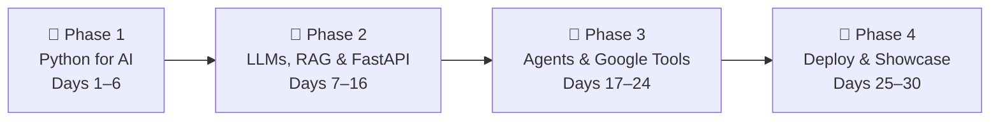

# 🚀 30-Day AI Engineering Roadmap
### From Web Developer → Junior AI Engineer
**Profile:** Basic Python | Web Developer background | 4 hours/day | 120 hours total
**Goal:** Build RAG apps, chatbots & agents — and be hireable as a Junior AI Engineer

---

## 🧭 Philosophy: What This Roadmap Is (and Isn't)

This is **not** a machine learning research roadmap. You will **not** train models from scratch, tune neural networks, or touch PyTorch deeply.

This roadmap teaches you to be an **AI Application Engineer** — someone who:
- Builds end-to-end RAG pipelines, chatbots, and agents
- Serves AI features through real APIs (FastAPI)
- Uses structured outputs and evaluates AI quality properly
- Deploys working apps that real users can access
- Has the vocabulary, tools, and portfolio to get hired

> **Rule of thumb:** If a concept doesn't directly help you build something or appear in job descriptions, it is filtered out.

---

## ⚠️ Gap Analysis vs. Junior AI Engineer Job Market

This roadmap was designed by comparing what employers actually ask for in job postings.
Here is every tool and skill you will cover:

| Tool / Skill | Why It Matters | Covered |
|---|---|---|
| Python (intermediate) | Non-negotiable foundation | ✅ Week 1 |
| NumPy + Pandas | Substrate of all AI data work | ✅ Days 2–3 |
| Pydantic | Data validation — used in every FastAPI + LLM project | ✅ Days 8, 16 |
| OpenAI API | Standard in almost every job posting | ✅ Day 5 |
| Gemini API (Google) | Your platform advantage | ✅ Days 1, 21 |
| Hugging Face Transformers | Model access, embeddings, NLP vocab | ✅ Day 6 |
| LangChain + LCEL | #1 orchestration framework interviewers test | ✅ Days 7–9 |
| LangGraph | Agents + stateful workflows | ✅ Days 17–19 |
| ChromaDB | Local vector DB for development | ✅ Days 11–12 |
| Pinecone (or equivalent) | Cloud vector DB, appears in most job posts | ✅ Day 14 |
| RAG pipeline (full) | #1 most-requested applied AI skill | ✅ Days 10–15 |
| RAGAS evaluation | Differentiator: proves you care about quality | ✅ Day 13 |
| LangSmith observability | Production monitoring — asked in interviews | ✅ Day 20 |
| FastAPI | Near-universal requirement for serving AI features | ✅ Days 16, 23 |
| Async Python (asyncio) | Expected for API development | ✅ Day 16 |
| Structured outputs / JSON mode | Critical for reliable AI pipelines | ✅ Days 5, 8 |
| Docker basics | Expected for production deployment | ✅ Day 25 |
| Firebase Hosting + Genkit (JS) | Your Google platform — web dev strength | ✅ Day 22 |
| Firestore Vector Search | Google-native vector DB | ✅ Day 23 |
| Google AI Studio | Prototyping + API keys | ✅ Day 21 |
| LangSmith tracing | Observability in production | ✅ Day 20 |
| Web frontend integration | Leverage your web dev background | ✅ Days 22, 24 |
| GitHub portfolio + READMEs | #1 hiring signal for junior roles | ✅ Days 6, 15, 27 |
| LinkedIn + certificates | Resume building | ✅ Days 6, 26, 28 |

---

## 🗺️ The Big Picture (4 Phases)



---

## 🎓 All Free Certificates You Will Earn

| # | Course | Platform | Hours | Certificate |
|---|--------|----------|-------|-------------|
| 1 | [Pandas](https://www.kaggle.com/learn/pandas) | Kaggle | 4h | ✅ Free |
| 2 | [Intro to Machine Learning](https://www.kaggle.com/learn/intro-to-machine-learning) | Kaggle | 3h | ✅ Free |
| 3 | [Prompt Engineering for Developers](https://learn.deeplearning.ai/courses/chatgpt-prompt-eng) | DeepLearning.AI | 1.5h | ✅ Free |
| 4 | [Building Systems with the ChatGPT API](https://learn.deeplearning.ai/courses/chatgpt-building-system) | DeepLearning.AI | 2h | ✅ Free |
| 5 | [LangChain: Chat with Your Data](https://learn.deeplearning.ai/courses/langchain-chat-with-your-data) | DeepLearning.AI | 2.5h | ✅ Free |
| 6 | [Building & Evaluating Advanced RAG](https://learn.deeplearning.ai/courses/building-evaluating-advanced-rag) | DeepLearning.AI | 2h | ✅ Free |
| 7 | [Functions, Tools & Agents with LangChain](https://learn.deeplearning.ai/courses/functions-tools-agents-langchain) | DeepLearning.AI | 3h | ✅ Free |
| 8 | [Introduction to LangChain](https://academy.langchain.com/courses/intro-to-langchain) | LangChain Academy | 6h | ✅ Free |
| 9 | [Introduction to LangGraph](https://academy.langchain.com/courses/intro-to-langgraph) | LangChain Academy | 6h | ✅ Free |
| 10 | [Google AI Essentials](https://www.coursera.org/learn/google-ai-essentials) | Coursera (Google) | ~10h | ✅ Free (audit) |

**Target: 9–10 certificates by Day 30**

---

## 📦 Portfolio Projects You Will Build

| Project | Key Skills Demonstrated |
|---------|------------------------|
| `day2-embeddings-scratch` | Embeddings, cosine similarity, NumPy |
| `day5-llm-pipeline-cli` | OpenAI + Gemini APIs, prompt pipelines, JSON output |
| `day8-langchain-classifier` | LangChain LCEL, Pydantic structured outputs |
| `day12-rag-chatbot` ⭐ | Full RAG pipeline — your flagship project |
| `day16-rag-fastapi` | FastAPI + async, serving RAG as a REST API |
| `day18-research-agent` | LangGraph, ReAct pattern, tool use |
| `day22-firebase-ai-app` | Firebase Genkit (JS), web frontend, Gemini API |
| `day25-deployed-app` | Docker basics, Cloud Run or Firebase Hosting |

---

## 📚 Phase 1 — Python for AI Foundations (Days 1–6)

**Goal:** Close the Python-for-AI gap. Learn the core vocabulary and tools.

### What You Will Learn
- NumPy arrays — the math substrate under every embedding and tensor
- Pandas DataFrames — loading, cleaning, inspecting real data
- What embeddings are and how cosine similarity works
- LLM vocabulary — tokens, context window, temperature, top-p, hallucination
- Hugging Face — accessing open-source models and the transformers ecosystem
- How to call the OpenAI API and the Gemini API from Python

### Resources for Phase 1

| Resource | Link | Time |
|----------|------|------|
| Kaggle Pandas | [kaggle.com/learn/pandas](https://www.kaggle.com/learn/pandas) | 4h |
| Kaggle Intro to ML | [kaggle.com/learn/intro-to-machine-learning](https://www.kaggle.com/learn/intro-to-machine-learning) | 3h |
| DL.AI: Text Embeddings | [learn.deeplearning.ai/courses/google-cloud-vertex-ai](https://learn.deeplearning.ai/courses/google-cloud-vertex-ai) | 1.5h |
| DL.AI: Prompt Engineering for Developers | [learn.deeplearning.ai/courses/chatgpt-prompt-eng](https://learn.deeplearning.ai/courses/chatgpt-prompt-eng) | 1.5h |
| Hugging Face NLP Course (Ch. 1–2 only) | [huggingface.co/learn/nlp-course](https://huggingface.co/learn/nlp-course/chapter1/1) | 2h |

---

## 🧠 Phase 2 — LLMs, LangChain, RAG & FastAPI (Days 7–16)

**Goal:** Build a complete RAG system and serve it through a real API.

### What You Will Learn
- LangChain LCEL: composable pipelines (`prompt | model | parser`)
- Pydantic: structured output validation (used in both LangChain and FastAPI)
- Full RAG pipeline from PDF to answer
- Vector databases: ChromaDB (local) and Pinecone (cloud)
- Advanced RAG: HyDE, multi-query retrieval, reranking
- RAGAS: evaluating retrieval and answer quality
- **FastAPI**: building async REST APIs to serve AI features
- **Async Python**: `async/await`, `asyncio` — required for non-blocking LLM calls

### Resources for Phase 2

| Resource | Link | Time |
|----------|------|------|
| LangChain Academy: Intro to LangChain | [academy.langchain.com/courses/intro-to-langchain](https://academy.langchain.com/courses/intro-to-langchain) | 6h |
| DL.AI: Chat with Your Data | [learn.deeplearning.ai/courses/langchain-chat-with-your-data](https://learn.deeplearning.ai/courses/langchain-chat-with-your-data) | 2.5h |
| DL.AI: Building & Evaluating Advanced RAG | [learn.deeplearning.ai/courses/building-evaluating-advanced-rag](https://learn.deeplearning.ai/courses/building-evaluating-advanced-rag) | 2h |
| DL.AI: Building Systems with the ChatGPT API | [learn.deeplearning.ai/courses/chatgpt-building-system](https://learn.deeplearning.ai/courses/chatgpt-building-system) | 2h |
| DL.AI: Advanced Retrieval with Chroma | [learn.deeplearning.ai/courses/advanced-retrieval-for-ai](https://learn.deeplearning.ai/courses/advanced-retrieval-for-ai) | 2h |
| FastAPI Official Tutorial (AI-relevant parts) | [fastapi.tiangolo.com/tutorial](https://fastapi.tiangolo.com/tutorial/) | 3h |

### The RAG Pipeline You Must Know Cold

```
1. Load Documents  →  PDFs, .txt, web pages
2. Split / Chunk   →  RecursiveCharacterTextSplitter
3. Embed           →  OpenAI / Gemini embedding model
4. Store           →  ChromaDB (local dev) / Pinecone (cloud)
5. Query           →  User question → embed → KNN similarity search
6. Retrieve        →  Top-k matching chunks returned
7. Generate        →  Retrieved chunks + question → LLM → final answer
8. Evaluate        →  RAGAS: faithfulness, answer relevancy, context recall
```

---

## 🤖 Phase 3 — Agents & Google Tools (Days 17–24)

**Goal:** Build stateful agents. Connect your Python backend to Firebase and your web developer skills.

### What You Will Learn
- LangGraph: nodes, edges, state graphs — the modern way to build agents
- ReAct pattern (Reasoning + Acting loops)
- Tool calling: giving LLMs access to functions, web search, databases
- LangSmith: tracing, cost tracking, prompt versioning
- Google AI Studio: multimodal inputs, system instructions, API key management
- **Firebase Genkit (JavaScript):** deploying Gemini-powered flows — this is where your web dev skills shine
- Firestore Vector Search: Google-native cloud vector database
- Building a real web frontend connected to your AI Python backend

### Resources for Phase 3

| Resource | Link | Time |
|----------|------|------|
| LangChain Academy: Intro to LangGraph | [academy.langchain.com/courses/intro-to-langgraph](https://academy.langchain.com/courses/intro-to-langgraph) | 6h |
| DL.AI: Functions, Tools & Agents | [learn.deeplearning.ai/courses/functions-tools-agents-langchain](https://learn.deeplearning.ai/courses/functions-tools-agents-langchain) | 3h |
| DL.AI: LLMOps | [learn.deeplearning.ai/courses/llmops](https://learn.deeplearning.ai/courses/llmops) | 2h |
| Firebase Genkit JS Docs | [firebase.google.com/docs/genkit](https://firebase.google.com/docs/genkit) | — |
| Gemini API Python Quickstart | [ai.google.dev/gemini-api/docs/quickstart](https://ai.google.dev/gemini-api/docs/quickstart?lang=python) | — |
| LangSmith (free) | [smith.langchain.com](https://smith.langchain.com) | — |

---

## 🚢 Phase 4 — Deploy, Certify & Showcase (Days 25–30)

**Goal:** Get everything live, polished, and findable by recruiters.

### Platforms to Activate

| Platform | Action |
|----------|--------|
| [me.developers.google.com](https://me.developers.google.com/) | Complete profile, link GitHub, earn developer badges |
| [skills.google](https://www.skills.google/) | Complete Google Cloud Generative AI learning path |
| [coursera.org/google-certificates/google-ai](https://www.coursera.org/google-certificates/google-ai) | Google AI Essentials (audit = free) |
| GitHub | Polish all READMEs with architecture diagrams and screenshots |
| LinkedIn | Add all certificates, update headline, write 1 featured post |
| [notebooklm.google](https://notebooklm.google/) | Upload docs and use as your personal research assistant |

---

## 📅 30-Day Daily Calendar

> **Each day = ~4 hours. Split: 1.5–2h learning → 2–2.5h building.**

---

### 🗓️ Week 1 — Python for AI (Days 1–6)

---

#### Day 1 — Environment Setup + First Gemini Call
**Study (1.5h):**
- Install: Python 3.11+, VS Code, `pip`, `venv`
- Get your **Gemini API key** from [Google AI Studio](https://aistudio.google.com/) (link to your GCP project `crypto-snow-426714-f1`)
- Read: [What is an LLM?](https://www.cloudflare.com/learning/ai/what-is-a-large-language-model/) (~30 min)
- Read: [What is a token?](https://help.openai.com/en/articles/4936856-what-are-tokens-and-how-to-count-them) (~15 min)

**Build (2.5h):**
- Create a Python virtual environment and a GitHub repo `ai-engineering-journey`
- Write `hello_gemini.py` — calls the Gemini API with a prompt, prints the response
- Store your API key in `.env`, load with `python-dotenv`
- **Bonus:** Also sign up for a free [OpenAI API account](https://platform.openai.com/) — even $5 of credits is enough for the whole roadmap
- Push to GitHub with a README

```bash
pip install google-generativeai python-dotenv openai
```

---

#### Day 2 — NumPy + Embeddings from Scratch
**Study (2h):**
- [Kaggle Pandas](https://www.kaggle.com/learn/pandas) — complete lessons 1–3 (DataFrames, indexing, summary functions)
- Watch: [What are Embeddings? — Josh Starmer, 12 min](https://www.youtube.com/watch?v=viZrOnJclY0)

**Build (2h):**
- Write a Python script that:
  1. Generates embeddings for 10 sentences using the Gemini Embedding API
  2. Computes cosine similarity between all pairs manually with NumPy
  3. Prints: *"Most similar pair: [sentence A] ↔ [sentence B] — score: 0.94"*
- Push as `day2-embeddings-scratch`

```bash
pip install numpy
```

---

#### Day 3 — Pandas + ML Vocabulary
**Study (2h):**
- [Kaggle Pandas](https://www.kaggle.com/learn/pandas) — complete remaining lessons
- [Kaggle Intro to Machine Learning](https://www.kaggle.com/learn/intro-to-machine-learning) — lessons 1–4 only (skip model training depth)
- Key vocab to internalize: training/test split, overfitting, accuracy, what a "model" is

**Build (2h):**
- Load the [Titanic CSV dataset](https://www.kaggle.com/c/titanic/data) with Pandas
- Clean it: handle nulls, select relevant columns, inspect types
- Run a `scikit-learn` decision tree classifier, print accuracy score
- Export predictions to a new CSV
- Push as `day3-pandas-basics`

```bash
pip install pandas scikit-learn
```

---

#### Day 4 — Prompt Engineering Fundamentals
**Study (2h):**
- [DL.AI: Prompt Engineering for Developers](https://learn.deeplearning.ai/courses/chatgpt-prompt-eng) — full course (~1.5h)
- Key patterns: zero-shot, few-shot, chain-of-thought, JSON/structured output mode

**Build (2h):**
- Build `cli_assistant.py` using the **OpenAI API** (this is important — you need experience with both OpenAI and Gemini):
  1. Accepts user input in the terminal
  2. Classifies the intent (technical / creative / factual) with one LLM call
  3. Routes to the correct prompt template based on that classification
  4. Returns a structured JSON response: `{"answer": "...", "category": "...", "confidence": 0.9}`
- Push as `day4-prompt-engineering`

```bash
# openai already installed from Day 1
```

---

#### Day 5 — Multi-Step LLM Pipelines + OpenAI API
**Study (2h):**
- [DL.AI: Building Systems with the ChatGPT API](https://learn.deeplearning.ai/courses/chatgpt-building-system) — full course (~2h)
- Focus: classification chains, multi-step pipelines, moderation layer, chaining calls

**Build (2h):**
- Extend your Day 4 tool into a real pipeline `pipeline_cli.py`:
  1. **Step 1 — Moderation:** Check input for harmful content (OpenAI moderation endpoint or a simple Gemini safety check)
  2. **Step 2 — Classification:** Route to correct prompt template
  3. **Step 3 — Generation:** Generate structured JSON answer
  4. **Step 4 — Validation:** Verify the output is valid JSON before printing
  5. Wrap in a `while True` loop for multi-turn terminal conversation
- Push as `day5-llm-pipeline-cli`

---

#### Day 6 — Hugging Face + Review + Certificates
**Study (2.5h):**
- [Hugging Face NLP Course — Chapter 1](https://huggingface.co/learn/nlp-course/chapter1/1) (~1h) — covers what Transformers are, how models are hosted
- [Hugging Face NLP Course — Chapter 2](https://huggingface.co/learn/nlp-course/chapter2/1) (~1h) — using `pipeline()` to run inference
- Key takeaway: Hugging Face is the GitHub of AI models. You use `pipeline("task")` to run any open-source model in 3 lines

**Build (1.5h):**
- Write a comparison script `model_compare.py` that:
  1. Uses a Hugging Face `pipeline("sentiment-analysis")` to classify 5 movie reviews
  2. Sends the same 5 reviews to the Gemini API with a sentiment classification prompt
  3. Prints both results side by side in a table
- Push as `day6-hf-vs-gemini`

**Admin (1h):**
- Claim: Kaggle Pandas certificate + Kaggle Intro to ML certificate
- Claim: DL.AI Prompt Engineering certificate
- Write README files for all 4 projects this week
- Post on LinkedIn: *"Week 1 of my AI Engineering journey complete — 3 certificates earned. Here's what I built..."*

```bash
pip install transformers torch
```

---

### 🗓️ Week 2 — LangChain, RAG & FastAPI (Days 7–16)

---

#### Day 7 — LangChain Foundations Part 1
**Study (2h):**
- [LangChain Academy: Introduction to LangChain](https://academy.langchain.com/courses/intro-to-langchain) — Modules 1–2
- Key mental model: `prompt | model | parser` — each `|` is a Runnable composing into a chain

**Build (2h):**
- Recreate your Day 4 pipeline in LangChain LCEL:

```python
from langchain_google_genai import ChatGoogleGenerativeAI
from langchain_core.prompts import ChatPromptTemplate
from langchain_core.output_parsers import StrOutputParser

llm = ChatGoogleGenerativeAI(model="gemini-2.0-flash")
prompt = ChatPromptTemplate.from_template("Answer this clearly: {question}")
chain = prompt | llm | StrOutputParser()
print(chain.invoke({"question": "What is RAG?"}))
```
- Push as `day7-langchain-intro`

```bash
pip install langchain langchain-google-genai langchain-openai langchain-core
```

---

#### Day 8 — LangChain + Pydantic Structured Outputs
**Study (2h):**
- [LangChain Academy: Introduction to LangChain](https://academy.langchain.com/courses/intro-to-langchain) — Modules 3–4
- Focus: Pydantic output parsers, conversation memory, `with_structured_output()`
- **Key concept:** Pydantic is how you guarantee the LLM returns valid, typed JSON — it appears in nearly every job description

**Build (2h):**
- Build a document classifier that uses Pydantic for strict output validation:

```python
from pydantic import BaseModel
from langchain_openai import ChatOpenAI

class ClassificationResult(BaseModel):
    category: str       # "technical" | "business" | "general"
    confidence: float   # 0.0 to 1.0
    reason: str         # one sentence explanation

llm = ChatOpenAI(model="gpt-4o-mini")
structured_llm = llm.with_structured_output(ClassificationResult)
result = structured_llm.invoke("What is a transformer model?")
print(result.model_dump_json(indent=2))
```
- Push as `day8-langchain-classifier`

```bash
pip install pydantic
```

---

#### Day 9 — LangChain Part 3 + Certificate
**Study (2h):**
- [LangChain Academy: Introduction to LangChain](https://academy.langchain.com/courses/intro-to-langchain) — complete remaining modules + claim certificate

**Build (2h):**
- Build a multi-turn chatbot with:
  - Customizable system prompt (passed as variable)
  - Conversation history that persists across turns (using `ChatMessageHistory`)
  - `/clear` command to reset memory
  - `/summarize` command — asks the LLM to summarize the conversation so far
- Push as `day9-memory-chatbot`

---

#### Day 10 — RAG Part 1: Document Loading & Chunking
**Study (2h):**
- [DL.AI: Chat with Your Data](https://learn.deeplearning.ai/courses/langchain-chat-with-your-data) — Modules 1–3
- Key concepts: Document loaders, `RecursiveCharacterTextSplitter`, chunk size vs. overlap

**Build (2h):**
- Write a script that:
  1. Loads a PDF using `PyPDFLoader`
  2. Splits it into chunks with 3 different settings: (500/50), (1000/200), (2000/400)
  3. Prints the chunk count and average chunk size for each setting
  4. Saves all chunks to a JSON file for later inspection
- Try using your roadmap PDF as the input document

```bash
pip install pypdf langchain-community chromadb
```

---

#### Day 11 — RAG Part 2: Embeddings + Vector Store
**Study (2h):**
- [DL.AI: Chat with Your Data](https://learn.deeplearning.ai/courses/langchain-chat-with-your-data) — Modules 4–5
- Key concepts: similarity search, MMR retrieval, metadata filtering

**Build (2h):**
- Extend yesterday's script to:
  1. Embed all chunks using Google Generative AI Embeddings
  2. Store them in **ChromaDB** (persisted to disk)
  3. Query with a natural language question
  4. Print the top 3 chunks with similarity scores

```python
from langchain_community.vectorstores import Chroma
from langchain_google_genai import GoogleGenerativeAIEmbeddings

embeddings = GoogleGenerativeAIEmbeddings(model="models/embedding-001")
vectorstore = Chroma.from_documents(docs, embeddings, persist_directory="./chroma_db")
results = vectorstore.similarity_search_with_score("What is chunk overlap?", k=3)
for doc, score in results:
    print(f"Score: {score:.3f} | {doc.page_content[:100]}")
```

---

#### Day 12 — RAG Part 3: Full Pipeline (Flagship Project)
**Study (1h):**
- [DL.AI: Chat with Your Data](https://learn.deeplearning.ai/courses/langchain-chat-with-your-data) — Module 6

**Build (3h):**
- Build `day12-rag-chatbot` — complete RAG application:
  1. **Ingest:** Load PDF → chunk → embed → store in ChromaDB
  2. **Retrieve:** User question → embed → top-3 similar chunks
  3. **Generate:** Chunks + question → Gemini → streamed answer
  4. **Interface:** Terminal chatbot loop with `/ingest [path]` and `/ask [question]` commands
- Make the code clean, modular, and well-commented — this is your flagship project

**Claim:** DL.AI "Chat with Your Data" certificate

---

#### Day 13 — RAG Evaluation with RAGAS
**Study (2h):**
- [DL.AI: Building & Evaluating Advanced RAG](https://learn.deeplearning.ai/courses/building-evaluating-advanced-rag) — full course (~2h)
- Key metrics:
  - **Faithfulness** — does the answer only use info from retrieved chunks?
  - **Answer Relevancy** — does the answer actually address the question?
  - **Context Recall** — did retrieval find all the relevant chunks?

**Build (2h):**
- Add evaluation to your RAG chatbot:
  1. Create a test set: 5 question + expected answer pairs based on your PDF
  2. Run your RAG pipeline on each
  3. Score with RAGAS and print a summary table

```bash
pip install ragas datasets
```

---

#### Day 14 — Advanced RAG: Cloud Vector DB + Better Retrieval
**Study (2h):**
- [DL.AI: Advanced Retrieval for AI with Chroma](https://learn.deeplearning.ai/courses/advanced-retrieval-for-ai) — full course (~2h)
- Patterns: HyDE, multi-query retrieval, contextual compression, reranking

**Build (2h):**
- **Part A:** Sign up for [Pinecone free tier](https://www.pinecone.io/) and reindex your PDF into a Pinecone cloud index instead of ChromaDB. This gives you the cloud vector DB experience that job descriptions ask for.

```python
from langchain_pinecone import PineconeVectorStore
vectorstore = PineconeVectorStore.from_documents(docs, embeddings, index_name="rag-demo")
```

- **Part B:** Add one advanced retrieval pattern (choose one):
  - **HyDE:** Generate a hypothetical ideal answer, embed it, retrieve based on that
  - **Multi-query:** Generate 3 question variants, retrieve for each, merge results

```bash
pip install langchain-pinecone pinecone-client
```

---

#### Day 15 — RAG README + LinkedIn Post
**Build (4h):**
- Write the full README for `day12-rag-chatbot`:
  - Architecture diagram (Mermaid)
  - Installation steps + `requirements.txt`
  - How to run with a custom PDF
  - RAGAS evaluation results (table)
  - ChromaDB vs. Pinecone comparison (what you learned)
  - "What I'd improve next" section
- Post on LinkedIn with a screenshot: *"I just built a RAG chatbot that answers questions about any PDF — here's the architecture..."*

---

#### Day 16 — FastAPI: Serve Your RAG as a REST API
**Study (2h):**
- Read [FastAPI Tutorial](https://fastapi.tiangolo.com/tutorial/) — focus on: path operations, request bodies, async endpoints, background tasks, `StreamingResponse`
- Key concept: **Async Python** — LLM calls are slow (1–5 seconds). `async/await` lets your server handle other requests while waiting. This is required knowledge for AI APIs.

**Build (2h):**
- Build `day16-rag-fastapi` — wrap your RAG chatbot in a FastAPI service:

```python
from fastapi import FastAPI, UploadFile
from fastapi.responses import StreamingResponse
from pydantic import BaseModel

app = FastAPI()

class QueryRequest(BaseModel):
    question: str
    top_k: int = 3

@app.post("/ingest")
async def ingest_pdf(file: UploadFile):
    # Save file, chunk, embed, store in ChromaDB
    return {"status": "ingested", "filename": file.filename}

@app.post("/query")
async def query_rag(request: QueryRequest):
    async def stream_answer():
        async for token in rag_chain.astream({"question": request.question}):
            yield token
    return StreamingResponse(stream_answer(), media_type="text/plain")
```

- Test with `uvicorn app:app --reload` and Swagger UI at `http://localhost:8000/docs`
- Push as `day16-rag-fastapi`

**Claim:** DL.AI Advanced RAG + Building Systems certificates

```bash
pip install fastapi uvicorn python-multipart
```

---

### 🗓️ Week 3 — Agents & Google Tools (Days 17–24)

---

#### Day 17 — LangGraph Foundations Part 1
**Study (2h):**
- [LangChain Academy: Intro to LangGraph](https://academy.langchain.com/courses/intro-to-langgraph) — Modules 1–2
- Key mental model: nodes = Python functions, edges = routing logic, state = a shared TypedDict passed between nodes

**Build (2h):**
- Build a minimal LangGraph with 3 nodes:
  1. `classify` → routes to `simple_answer` or `needs_search`
  2. `simple_answer` → LLM answers directly
  3. `needs_search` → placeholder: prints *"[Would search: {query}]"*
- Visualize: `graph.get_graph().print_ascii()`

```bash
pip install langgraph
```

---

#### Day 18 — LangGraph Agents + Tool Calling
**Study (2h):**
- [LangChain Academy: Intro to LangGraph](https://academy.langchain.com/courses/intro-to-langgraph) — Modules 3–4
- [DL.AI: Functions, Tools & Agents](https://learn.deeplearning.ai/courses/functions-tools-agents-langchain) — first half (~1.5h)
- Key concepts: `@tool` decorator, tool binding, ReAct loop, `ToolNode`

**Build (2h):**
- Build `day18-research-agent`:
  1. A LangGraph ReAct agent with 3 tools: `web_search` (DuckDuckGo), `calculator`, `get_current_date`
  2. Loops until it reaches a final answer
  3. Prints each step (thought → tool call → observation → final answer)
- Test: *"How many days until the new year? What is 25% of that number?"*

```bash
pip install duckduckgo-search langchain-community
```

---

#### Day 19 — Advanced Agents + Human-in-the-Loop
**Study (2h):**
- [LangChain Academy: Intro to LangGraph](https://academy.langchain.com/courses/intro-to-langgraph) — remaining modules + claim certificate
- [DL.AI: Functions, Tools & Agents](https://learn.deeplearning.ai/courses/functions-tools-agents-langchain) — complete + claim certificate
- Key concept: **Checkpointing and human-in-the-loop** — pause the graph at a node, ask a human, resume

**Build (2h):**
- Add a human approval step to your research agent:
  - Before running a web search: print *"About to search: '{query}'. Approve? (y/n)"*
  - If `n`, agent retries with a direct answer instead
- Push update to `day18-research-agent`

---

#### Day 20 — LLMOps: LangSmith Tracing
**Study (2h):**
- [DL.AI: LLMOps](https://learn.deeplearning.ai/courses/llmops) — full course (~2h)
- Sign up for a free [LangSmith account](https://smith.langchain.com)
- Key concepts: tracing, prompt versioning, token cost tracking, comparing runs

**Build (2h):**
- Connect LangSmith to your RAG FastAPI app AND your research agent:

```python
import os
os.environ["LANGCHAIN_TRACING_V2"] = "true"
os.environ["LANGCHAIN_API_KEY"] = "your-langsmith-key"
os.environ["LANGCHAIN_PROJECT"] = "ai-engineering-journey"
```

- Run both apps, then open LangSmith UI and explore traces
- Add a LangSmith trace screenshot to your RAG project README
- Note token costs per query — this matters for production

---

#### Day 21 — Google AI Studio Deep Dive
**Study (1h):**
- Explore [Google AI Studio](https://aistudio.google.com/): try system instructions, multimodal (image) input, Gemini's function calling UI
- Read: [Gemini API Python Quickstart](https://ai.google.dev/gemini-api/docs/quickstart?lang=python)

**Build (3h):**
- Build a **multimodal image analyzer** using the raw `google-generativeai` SDK (no LangChain):
  1. User inputs an image path
  2. Script sends the image to Gemini with: *"Describe this image and suggest 3 blog post titles about it"*
  3. Returns structured JSON: `{"description": "...", "titles": ["...", "...", "..."]}`
  4. Also exports the result to a `.json` file
- Push as `day21-multimodal-analyzer`

> **Why raw SDK?** LangChain abstracts away the API. Knowing both shows you understand the underlying layer, which impresses interviewers.

---

#### Day 22 — Firebase Genkit (JavaScript) + Web Frontend
**Study (1h):**
- Read: [Firebase Genkit Getting Started (Node.js)](https://firebase.google.com/docs/genkit/get-started)
- Key concept: Genkit flows = deployable AI functions with built-in tracing, streaming, and Firebase Auth integration
- **Note:** Genkit's stable, production SDK is **JavaScript/TypeScript** — this is where your web developer skills are an advantage over pure Python engineers

**Build (3h):**
- Build `day22-firebase-ai-app` — a mini web app:
  1. **Backend (JS):** A Firebase Genkit flow that takes a topic and returns a blog post intro in JSON
  2. **Frontend (your web dev skills — HTML/CSS/JS):** A simple web page with a text input and "Generate" button that calls the Genkit flow via HTTP and displays the result
  3. Deploy to **Firebase Hosting** with `firebase deploy`
- This gives you a live, public URL for your project

```bash
npm install -g firebase-tools
firebase init  # select Hosting + Functions
npm install @genkit-ai/firebase @genkit-ai/googleai
```

---

#### Day 23 — Firestore Vector Search + Full-Stack RAG
**Study (1h):**
- Read: [Firestore Vector Search Docs](https://firebase.google.com/docs/firestore/vector-search)
- Key concept: Firestore supports KNN vector queries natively — no separate vector database needed in a Firebase app

**Build (3h):**
- Upgrade your Day 22 Firebase app to a full RAG demo:
  1. Python ingest script: chunk + embed a PDF → store embeddings in **Firestore** (your GCP project `crypto-snow-426714-f1`)
  2. Update the Genkit flow: on "Generate", query Firestore with KNN vector search → pass retrieved chunks to Gemini → return answer
  3. Web frontend: show the retrieved source chunks alongside the answer
- You now have a full-stack RAG app: Python ingest → Firestore → Genkit → HTML frontend

---

#### Day 24 — Connect Python FastAPI to Web Frontend
**Study (0.5h):**
- Read: [CORS in FastAPI](https://fastapi.tiangolo.com/tutorial/cors/) — required to call your Python API from a browser

**Build (3.5h):**
- Build a **web UI for your Day 16 FastAPI RAG API**:
  1. A clean HTML/CSS/JS page (use your web dev skills!)
  2. File upload button → calls `POST /ingest` on your FastAPI backend
  3. Chat input → calls `POST /query` and streams the response token by token
  4. Add CORS middleware to FastAPI so the browser can reach it
- Run FastAPI locally and open the HTML page — fully working chat UI
- Record a short screen capture of uploading a PDF and asking a question
- Push the frontend to your `day16-rag-fastapi` repo

```python
from fastapi.middleware.cors import CORSMiddleware
app.add_middleware(CORSMiddleware, allow_origins=["*"])
```

---

### 🗓️ Week 4 — Deploy, Certify & Showcase (Days 25–30)

---

#### Day 25 — Docker Basics + Cloud Run Deployment
**Study (1.5h):**
- Watch: [Docker in 100 Seconds — Fireship](https://www.youtube.com/watch?v=Gjnup-PuquQ) (2 min)
- Watch: [Docker Tutorial for Beginners — TechWorld with Nana](https://www.youtube.com/watch?v=3c-iBn73dDE) (~45 min — watch until "running a container")
- Read: [Cloud Run Python Quickstart](https://cloud.google.com/run/docs/quickstarts/build-and-deploy/deploy-python-service)
- Key concept: Docker = package your app + its dependencies into a container that runs identically everywhere

**Build (2.5h):**
- Containerize your `day16-rag-fastapi` app:

```dockerfile
FROM python:3.11-slim
WORKDIR /app
COPY requirements.txt .
RUN pip install -r requirements.txt
COPY . .
EXPOSE 8080
CMD ["uvicorn", "app:app", "--host", "0.0.0.0", "--port", "8080"]
```

- Build and run locally first: `docker build -t rag-api . && docker run -p 8080:8080 rag-api`
- Then deploy to **Google Cloud Run** in your project `crypto-snow-426714-f1`:

```bash
gcloud run deploy rag-api --source . --region us-central1 --allow-unauthenticated
```

- You now have a permanent public HTTPS URL for your RAG API

---

#### Day 26 — Google Developer Profile + Google Certificates
**Study + Admin (4h):**
- Complete your [Google Developer Profile](https://me.developers.google.com/) — fill in all fields, link GitHub
- Complete [skills.google](https://www.skills.google/) — finish the Generative AI learning path
- Enroll in and start [Google AI Essentials on Coursera](https://www.coursera.org/google-certificates/google-ai) — audit is free
- Add all certificates earned so far to LinkedIn under "Licenses & Certifications"
- Activate [NotebookLM](https://notebooklm.google/) — upload this roadmap and your project READMEs as sources

---

#### Day 27 — GitHub Portfolio Polish
**Build (4h):**
For every project repo, ensure the README has:
- [ ] A clear problem statement
- [ ] Architecture diagram (Mermaid or image)
- [ ] Step-by-step setup instructions
- [ ] Screenshot or GIF of the working app
- [ ] Tech stack badges from [shields.io](https://shields.io/)
- [ ] "What I learned" + "What I'd improve" sections

Pin your 3 best projects on your GitHub profile page. Update your GitHub profile README with a short bio positioning yourself as an AI Application Engineer.

---

#### Day 28 — LinkedIn & Personal Branding
**Build (4h):**
- **Headline:** Add "AI Application Developer | Python · LangChain · RAG"
- **About section:** *"Web developer building AI-powered applications using Python, LangChain, Gemini, and Firebase. I specialize in RAG pipelines, LLM agents, and connecting AI backends to real web interfaces."*
- **Skills to add:** LangChain, LangGraph, RAG, FastAPI, Pydantic, Gemini API, OpenAI API, ChromaDB, Pinecone, LangSmith, Firebase, Vector Databases, Python, Prompt Engineering
- **Featured section:** Add your RAG chatbot demo (screenshot/video + deployed URL)
- **Write one LinkedIn post (300–400 words):**
  > *Hook:* "I just built a chatbot that answers questions about ANY PDF — and deployed it live. Here's the exact tech stack..."
  > Explain the 8-step RAG pipeline in plain language
  > Show: architecture diagram + screenshot
  > Close: link to your GitHub

---

#### Day 29 — Interview Prep: Talk Through Your Stack
**Study (4h):**
Practice these out loud — record yourself, then watch it back:

**LLM Fundamentals:**
- What is an embedding? Why is cosine similarity used instead of Euclidean distance for text?
- What is the difference between fine-tuning and RAG? When do you choose each?
- What is temperature? What does top-p do? What is a context window?
- What are hallucinations and what are 3 ways to reduce them?

**RAG:**
- Walk me through a RAG pipeline end to end, step by step
- What is chunk size and why does the chunking strategy matter?
- What is RAGAS and what metrics does it measure?
- What is HyDE and when is it useful?
- What is the difference between ChromaDB and Pinecone?

**LangChain / LangGraph:**
- What is LCEL? What does the `|` operator do?
- What is the difference between a chain and an agent?
- What is LangGraph? What is a node, an edge, and state?
- What is human-in-the-loop in LangGraph?

**FastAPI / Production:**
- Why do we use `async/await` in a FastAPI AI endpoint?
- What is Pydantic and why is it important for LLM outputs?
- How do you trace and monitor LLM calls? What is LangSmith?
- What is Docker and why is it useful for deploying AI services?

---

#### Day 30 — Final Review + Celebration 🎉
**Build + Reflect (4h):**
- Live demo check: can you demo your RAG chatbot + FastAPI + deployed Cloud Run URL in under 3 minutes?
- Final README pass on your top 3 repos
- Write a personal note in your `ai-engineering-journey` README: what you built, what you learned, what's next
- Post a "Day 30" LinkedIn update
- Plan your next project:
  - Multi-agent workflow: one agent researches, one writes, one reviews
  - Structured document extraction: LLM extracts JSON from PDFs using Pydantic + `instructor`
  - Persistent memory chatbot: long-term user memory stored in a database

---

## 🔑 Key Links Reference

| Resource | Link |
|----------|------|
| Google AI Studio (API keys + prototyping) | [aistudio.google.com](https://aistudio.google.com/) |
| DeepLearning.AI Short Courses | [learn.deeplearning.ai](https://learn.deeplearning.ai) |
| LangChain Academy | [academy.langchain.com](https://academy.langchain.com) |
| Kaggle Learn | [kaggle.com/learn](https://www.kaggle.com/learn) |
| Hugging Face NLP Course | [huggingface.co/learn/nlp-course](https://huggingface.co/learn/nlp-course/chapter1/1) |
| OpenAI API Docs | [platform.openai.com/docs](https://platform.openai.com/docs) |
| FastAPI Tutorial | [fastapi.tiangolo.com/tutorial](https://fastapi.tiangolo.com/tutorial/) |
| Firebase Console | [console.firebase.google.com](https://console.firebase.google.com/) |
| Firebase Genkit Docs (JS) | [firebase.google.com/docs/genkit](https://firebase.google.com/docs/genkit) |
| Google Cloud Console | [console.cloud.google.com](https://console.cloud.google.com/welcome?project=crypto-snow-426714-f1) |
| Google Developer Profile | [me.developers.google.com](https://me.developers.google.com/) |
| Google AI Essentials (Coursera) | [coursera.org/google-certificates/google-ai](https://www.coursera.org/google-certificates/google-ai) |
| skills.google | [skills.google](https://www.skills.google/) |
| NotebookLM | [notebooklm.google](https://notebooklm.google/) |
| LangSmith (free observability) | [smith.langchain.com](https://smith.langchain.com) |
| Pinecone (free tier) | [pinecone.io](https://www.pinecone.io/) |
| RAGAS Docs | [docs.ragas.io](https://docs.ragas.io) |
| LangChain Docs | [python.langchain.com](https://python.langchain.com/docs/introduction) |
| LangGraph Docs | [langchain-ai.github.io/langgraph](https://langchain-ai.github.io/langgraph/) |
| ChromaDB Docs | [docs.trychroma.com](https://docs.trychroma.com) |
| Docker in 100 Seconds | [youtube.com/watch?v=Gjnup-PuquQ](https://www.youtube.com/watch?v=Gjnup-PuquQ) |

---

## ✅ What You Can Honestly Claim After 30 Days

**Python AI Stack:**
- Built production-quality RAG systems with LangChain, ChromaDB, Pinecone, and Firestore Vector Search
- Served AI features as async REST APIs using FastAPI and Pydantic
- Validated structured LLM outputs with Pydantic schemas

**Agents & Orchestration:**
- Designed stateful agentic workflows with LangGraph (ReAct pattern, tool use, human-in-the-loop)
- Integrated web search, calculators, and database tools into agent loops

**Google Ecosystem:**
- Used Google AI Studio for prompt prototyping and Gemini API key management
- Built and deployed Genkit flows on Firebase (JavaScript)
- Stored and queried vector embeddings in Firestore Vector Search

**Evaluation & Production:**
- Evaluated RAG quality with RAGAS (faithfulness, answer relevancy, context recall)
- Traced and monitored LLM calls with LangSmith
- Containerized an AI service with Docker and deployed it to Google Cloud Run

**Multi-Model Experience:**
- Worked with both the OpenAI API (GPT-4o-mini) and the Gemini API
- Ran open-source models via the Hugging Face `transformers` library

**Portfolio & Credentials:**
- 6–8 public GitHub projects with architecture diagrams and live demo links
- 9–10 free certificates from Kaggle, DeepLearning.AI, LangChain Academy, and Google

---

> **What NOT to overclaim:** Deep ML research, model training from scratch, or fine-tuning.
> Saying *"I understand the concepts but haven't done hands-on fine-tuning yet"* is completely honest and appropriate for a Junior AI Application Engineering role.
