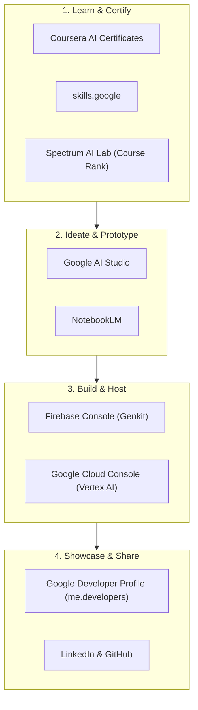

# 🗺️ Web Developer to AI Engineer Roadmap

Welcome to your AI Engineering learning path! This roadmap is designed to help you leverage your Google Cloud project, developer accounts, and AI learning resources to transition from a full-stack web developer to a capable AI Engineer.

---

## 🗺️ Ecosystem Overview

Here is how the tools and resources you have access to connect with one another, moving from learning to building, and finally to sharing your work.

---

## 🛠️ Phase 1: Ideation & Prototyping

Before writing full-stack backend code, build intuition around model prompting, parameters, and multimodal capabilities.

### 1. Google AI Studio
*   **Link:** [aistudio.google.com](https://aistudio.google.com/)
*   **Purpose:** Prototyping prompts, testing system instructions, and generating API keys.
*   **Actions:**
    1. Go to AI Studio and click **Get API Key**. Create an API key associated with your Google Cloud project (`crypto-snow-426714-f1`).
    2. Experiment with chat prompting, system instructions, temperature, and safety settings.
    3. Use the **Get Code** button to export configurations directly as JavaScript or TypeScript code to plug into frontend apps.

### 2. NotebookLM
*   **Link:** [notebooklm.google](https://notebooklm.google/)
*   **Purpose:** Summarizing codebases, parsing developer documentation, and creating research summaries.
*   **Actions:**
    1. Create notebooks for new libraries you learn (e.g., Firebase Genkit documentation, Vertex AI reference manuals).
    2. Upload your own draft code files to get feedback, code explanations, or architectural optimization suggestions.

---

## 🎓 Phase 2: Learning & Certifications

Build structured, credentialed knowledge that recruiters look for on resumes and LinkedIn profiles.

### 1. Coursera Google AI Certificates
*   **Link:** [Google AI on Coursera](https://www.coursera.org/google-certificates/google-ai)
*   **Key Focus:** Earning professional credentials like the **Google AI Essentials Certificate**.
*   **Outcome:** Adds high-credibility badges directly to your LinkedIn and resume.

### 2. Google Skills
*   **Link:** [skills.google](https://www.skills.google/)
*   **Key Focus:** Google Cloud learning paths. Focus on the **Google Cloud Learning Path for Generative AI**.
*   **Outcome:** Earning Cloud Skills Boost badges.

### 3. Spectrum AI Lab (Course Rankings)
*   **Link:** [Spectrum AI Lab: 13 AI Courses Ranked](https://spectrumailab.com/blog/google-skills-13-ai-courses-ranked-2026#developers)
*   **Key Focus:** Navigate courses ranked specifically for developers.
*   **Priorities:**
    *   *Generative AI Fundamentals*
    *   *Introduction to Vertex AI*

---

## 🏗️ Phase 3: Building & Hosting

Apply your full-stack web development skills to AI orchestration, security, and cloud deployment.

### 1. Firebase Console (AI & Genkit)
*   **Link:** [console.firebase.google.com](https://console.firebase.google.com/)
*   **Genkit Framework:**
    *   Initialize it via terminal: `firebase init genkit`.
    *   Use the local Developer UI (`genkit start`) to trace execution, inspect prompt runs, and troubleshoot API calls.
*   **Firebase AI Logic:**
    *   Deploy Gemini-powered flows secured with Firebase Authentication and App Check.
*   **Vector Database:**
    *   Use **Cloud Firestore Vector Search** to store embeddings and perform semantic similarity searches.

### 2. Google Cloud Console (GCP)
*   **Link:** [console.cloud.google.com](https://console.cloud.google.com/welcome?project=crypto-snow-426714-f1)
*   **Workspace project:** `crypto-snow-426714-f1`
*   **Vertex AI:** Get access to enterprise model settings, Grounding APIs (connecting LLMs to real-time Google search), and pipelines.
*   **Cloud Run:** Package your Genkit flows inside Node.js containers and deploy them to Cloud Run serverless endpoints.

---

## 📣 Phase 4: Showcase & Brand

A portfolio of AI-powered web applications is your strongest asset. Build in public and document your progress.

### 1. Google Developer Profile
*   **Link:** [me.developers.google.com](https://me.developers.google.com/)
*   **Goal:** A public portfolio showing your official Google learning badges, paths completed, and milestones achieved. Link this profile on your resume.

### 2. "Build-in-Public" Sharing Strategy
*   **GitHub Repositories:** Store all code publically. Maintain clean README files detailing how you structured prompt flows, how you handled context windows, and how you integrated databases.
*   **LinkedIn/Socials:** Post about your building milestones:
    *   *Hook:* E.g., *"How I integrated vector search into my Firestore DB in under 2 hours."*
    *   *Architecture:* Explain how the data flow moves from the UI ➡️ Genkit ➡️ Gemini Embeddings ➡️ Firestore.
    *   *Demonstration:* Attach a short screen recording or GIF showing the interface.

---

## 🚀 Recommended Practice Projects

### Project 1: Semantic rulebook search (RAG application)
*   **Description:** Upload documentation or textbooks, parse them into chunks, create embeddings, and query them using natural language.
*   **Stack:** Vite (React/TS), Firebase Genkit, Firestore Vector Search, Gemini 1.5/2.0/3.0 flash model, hosted on Firebase Hosting.

### Project 2: Smart Chrome Extension for Code Refactoring
*   **Description:** Select code snippets on any website and send them to a deployed GCP API for immediate refactoring or debugging suggestions.
*   **Stack:** Chrome Extension API (JS/HTML/CSS), Cloud Run (Node/Express backend), Vertex AI.
